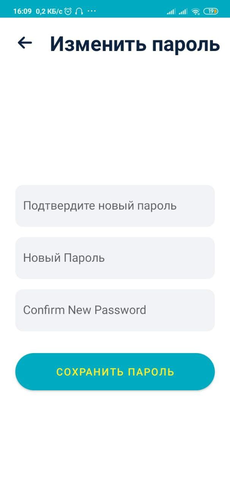
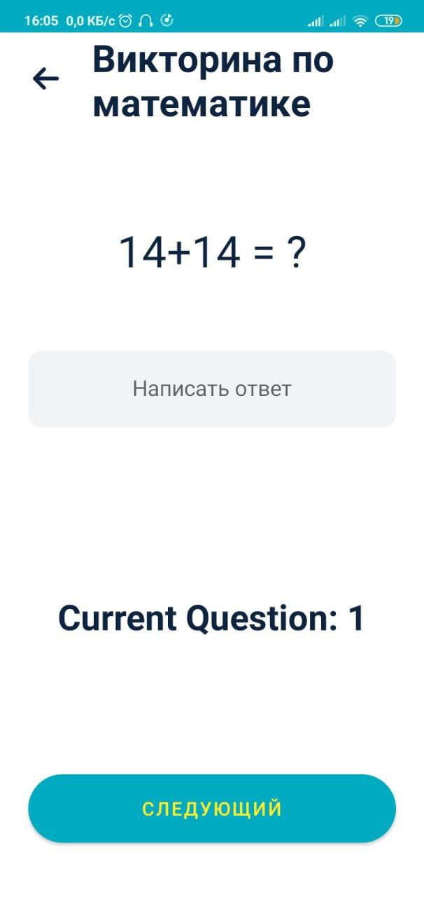
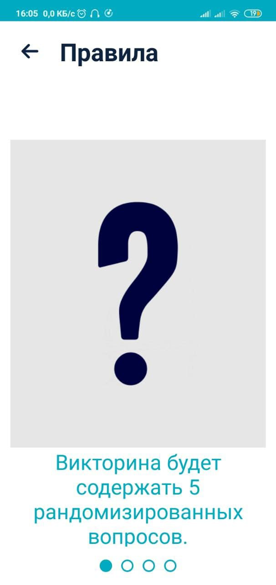
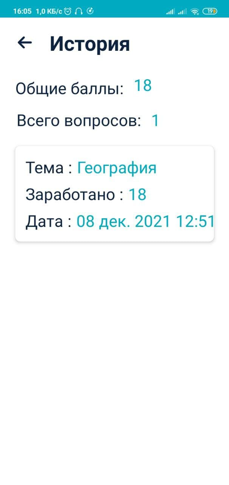
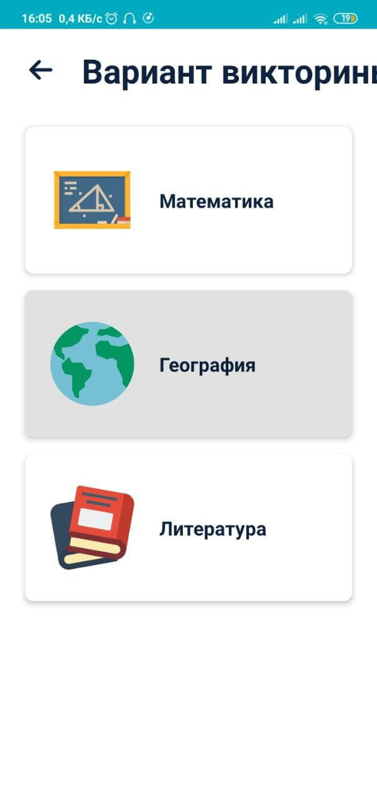
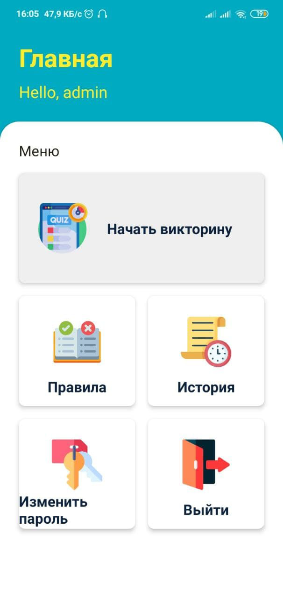
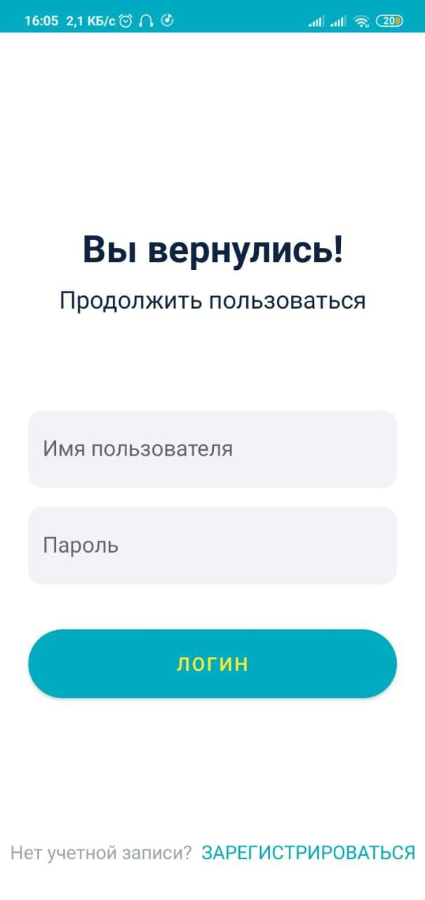

## Приложение для викторины 
Приложение Quiz для Android 📱 созданное с использованием Java ♨️ и демонстрирующее передовой опыт 🛠️ Room 
-------------------

## ❤️ Попробуйте приложение 
## Сканируйте QR-код 
  
---------------
### Get Apk [Download here](https://raw.githubusercontent.com/pikachu404/Quiz-App/master/app/release/app-release.apk)
------------
## ⚙️ Функции 
* Приложение состоит из викторины по трем основным предметам - математика, география, литература.
* Сохранение истории предыдущих попыток викторины с использованием комнаты.
* Вы можете переключать пользователей, используя Вход / Регистрация
* Возможность изменить текущий пароль
* Добавлен загрузчик при извлечении данных из API
* Отображение результата в конце викторины.
* Реализован вход, регистрация, изменение пароля, предыдущие попытки - все с использованием SQL Lite DB с использованием Room 

## 🚀 Используемая технология 

* Quiz App is build using Java
* Asynctask for asynchronous
* Room Persistence Library

## 📸 Скриншоты

||||
|:----------------------------------------:|:-----------------------------------------:|:-----------------------------------------: |
|  |  |  |
|  |  |  |
|  |  |  |


## Лицензия
```
Лицензия MIT

Copyright (c) 2021 Сагар Хурана

Разрешение предоставляется бесплатно любому лицу, получившему копию.
этого программного обеспечения и связанных файлов документации («Программное обеспечение») для работы с
в Программном обеспечении без ограничений, включая, помимо прочего, права
использовать, копировать, изменять, объединять, публиковать, распространять, сублицензировать и / или продавать
копий Программного обеспечения и разрешить лицам, которым Программное обеспечение
предоставлены для этого при соблюдении следующих условий:

Вышеупомянутое уведомление об авторских правах и это уведомление о разрешении должны быть включены во все
копии или существенные части Программного обеспечения.

ПРОГРАММНОЕ ОБЕСПЕЧЕНИЕ ПРЕДОСТАВЛЯЕТСЯ «КАК ЕСТЬ», БЕЗ КАКИХ-ЛИБО ГАРАНТИЙ, ЯВНЫХ ИЛИ ЯВНЫХ.
ПОДРАЗУМЕВАЕМЫЕ, ВКЛЮЧАЯ, НО НЕ ОГРАНИЧИВАЯСЬ, ГАРАНТИИ КОММЕРЧЕСКОЙ ЦЕННОСТИ,
ПРИГОДНОСТЬ ДЛЯ КОНКРЕТНОЙ ЦЕЛИ И ЗАЩИТА ОТ ПРАВ. НИ В КОЕМ СЛУЧАЕ
АВТОРЫ ИЛИ ДЕРЖАТЕЛИ АВТОРСКИХ ПРАВ НЕСУТ ОТВЕТСТВЕННОСТЬ ЗА ЛЮБЫЕ ПРЕТЕНЗИИ, УБЫТКИ ИЛИ ДРУГИЕ
ОТВЕТСТВЕННОСТЬ, ВОЗНИКАЮЩАЯ ЛИ В РЕЗУЛЬТАТЕ ДОГОВОРА, ПРАКТИКИ ИЛИ ИНЫМ ОБРАЗОМ,
БЕЗ ПРОГРАММНОГО ОБЕСПЕЧЕНИЯ ИЛИ В СВЯЗИ С ПРОГРАММНЫМ ОБЕСПЕЧЕНИЕМ, ИЛИ ИСПОЛЬЗОВАНИЕМ ИЛИ ДРУГИМИ ДЕЛАМИ
ПРОГРАММНОЕ ОБЕСПЕЧЕНИЕ. 
```
